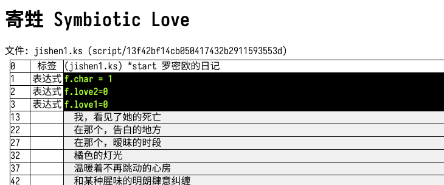

# Біла Роса

名称: “白露”

## 支持

1. 寄甡 Symbiotic Love
2. 千面 Melancholy Love
3. 夜永 Eternal Love
   (3.5? 秘密舞会)

## 用法

使用 asar 工具解压 resources 下的 main.asar, voice.asar 文件解压至同一文件夹。可以用以下指令

> asar e FILENAME.asar FOLDER

然后在文件夹下运行对应的 JS 文件，即得到 index.html 文件。

> node 1-jishen-symbiotic-love.js

## 截图

